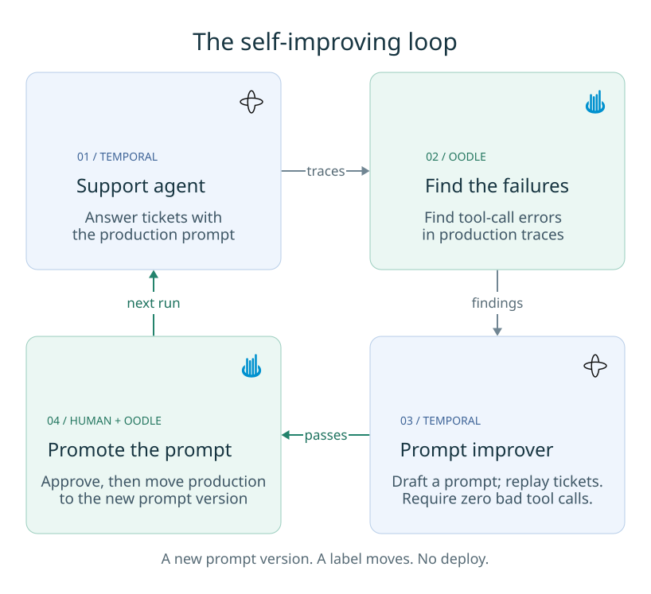

# A self-improving prompt loop on Temporal, closed by Oodle

A Temporal workflow runs a small support agent. Oodle watches it and, on its own,
reports that the agent keeps calling its tools with the wrong arguments. A second
workflow turns that finding into a new prompt, proves the new prompt is better, asks
a person to approve it, and ships it by moving a label. The next agent run picks it
up. There is no deploy.

Nobody wrote a test set. What the improver learns from is real traffic that Oodle
already recorded and analysed.



Two more views go a level down: the
[agent workflow](diagrams/02-support-agent-workflow.svg) and the
[improver workflow](diagrams/03-prompt-improver-workflow.svg). Source and rebuild
instructions are in [diagrams/](diagrams/).

## The mistake, on purpose

Version 1 of the prompt (`app/seed.py`) never says what an order number looks like,
never says the refund amount is in cents, and never lists the allowed reason codes.
The tool descriptions that ship with it are just as vague: `order_id` is described
only as "the order".

The tools (`app/tools.py`) enforce the real rules anyway. So the model has to learn
them the expensive way, from error messages, several turns in:

```
lookup_order(order_id="78432")
  -> rejected: order_id must look like ORD-78432
lookup_order(order_id="ORD-78432")                       ok
issue_refund(order_id="ORD-78432", amount_cents=24.99, reason_code="damaged")
  -> rejected: amount_cents is a whole number of cents, not dollars
issue_refund(order_id="ORD-78432", amount_cents=2499, reason_code="damaged")
  -> rejected: reason_code must be one of [...]
issue_refund(order_id="ORD-78432", amount_cents=2499, reason_code="damaged_in_transit")
```

Every ticket costs about **5 model calls and 2 failed tool calls**. Oodle marks those
failed calls as bad-argument errors by itself. No evaluator, no scoring rules, nothing
to configure.

## What Oodle found

Oodle reported this without being asked:

> **Invalid tool arguments: `lookup_order`.** Calls were rejected for malformed or
> missing arguments, on at least 100 calls in the sampled traces.
>
> **Tool returned an error: `issue_refund`.** Failing on at least 84 calls, all for
> bad arguments.

That is the starting point of the whole demo, and it is specific enough to act on.
The improver read it, wrote a new prompt, passed the test at zero bad tool calls, and
a person approved it. The prompt that is live now says: *"look up their order using
the correct ORD-XXXXX format, and if the complaint is valid, refund them using the
exact allowed reason codes."*

Measured on this demo, before and after:

| prompt version | traces | avg model calls | avg tool calls | avg failed tool calls |
|---|---|---|---|---|
| v1, the vague one | 8 | 4.8 | 3.5 | 2.00 |
| the improver's rewrite | 3 | 3.0 | 2.0 | 0.00 |

The worker was never restarted between those two rows. A label moved. That was the
entire deploy.

## Run it

**Nothing calls a model on its own.** `make up` starts Temporal, the telemetry
collector, and an idle worker. Every model call this demo makes is one you asked for.
On a free Gemini key that is the difference between a demo you can still run tomorrow
and one that has used up its daily allowance.

```bash
cp .env.example .env      # your Oodle instance and API key, and a Gemini key
make seed                 # create the vague prompt v1
make up                   # Temporal, collector, idle worker. No model calls.
make ticket               # one agent run. The first model calls.
```

### Or drive it from the browser

`make up` also starts a small UI on <http://localhost:8090>:

1. The storefront (`/`) is a ShopWorld order page with a support chat. Each message runs one `SupportAgentWorkflow` and shows the prompt version, model turns, and bad tool calls.
2. The approval page (`/approval`) starts the improver and can hand it a finding. It then shows the Oodle findings, the gate result, and the prompt diff, with Approve and Reject buttons.

When a candidate passes the gate, the improver posts to Slack. The message holds the diff and links to the approval page, the Temporal workflow, both prompt versions in Oodle, and the Oodle insights. To enable it, set `SLACK_WEBHOOK_URL` in `.env`. If it is not set, the worker logs the message instead.

`make help` lists everything. These are the commands that cost model calls:

| Command | Cost |
|---|---|
| `make ticket` (or `make ticket T=T-1003`) | one agent run, about 5 model calls on v1 |
| `make all` | all four tickets, about 20 model calls on v1 |
| `make improver` | nothing while it waits for a finding. Per finding: 1 call to write a new prompt, and about 12 for the Oodle experiment over 4 tickets |

Everything else is free: `prompt`, `insights`, `status`, `approve`, `reject`,
`rollback`, `models`, `nudge`, `stopimprover`.

Temporal UI: <http://localhost:8083>. In Oodle, look under GenAI for traces, prompts
and findings.

Oodle needs a reasonable amount of traffic before it reports anything, so run
`make all` a few times.

## Four things that are not incidental

**Looking up the live prompt happens in an Activity, never in workflow code.**
Temporal replays workflow code. If the workflow asked "which version is live?"
directly, a replay after the label moved would get a *different* answer than the
original run, which breaks replay. And moving that label is the entire point of this
demo, so it would definitely happen. Instead an Activity resolves the label to a
version number once, at the start of the run, and that number is fixed for the rest of
the run. "The agent picks up the new prompt" therefore means *the next run*, never
half way through one.

It also makes the loop easy to see: every trace is tagged with the version it used, so
you can compare cost, speed and error rate version by version. One tag, no explosion
of label values.

**One trace, not a thousand.** The top-level span is opened when the ticket is
submitted, and Temporal's tracing interceptor carries it through. So every model call
and tool call, across every Activity, ends up in a single trace with the right
parent-child structure.

**The test step.** Before anything ships, the new prompt must make zero bad tool
calls on real tickets. Without this the system is self-*changing*, not self-improving.

The improver does not run this test itself. It publishes the candidate with the
`candidate` label and starts an Oodle experiment over the `order-support-eval` dataset
(`make seed` creates it). Oodle posts each ticket to an experiment webhook. The webhook
runs the real `SupportAgentWorkflow`, pinned to the candidate version named in the run
(`prompt-v4-…`). The improver waits on a durable timer and reads the run's results.
Each result row in Oodle links to the agent's trace, because the webhook continues the
`traceparent` that Oodle sends.

Oodle calls the webhook from the internet. A Cloudflare quick tunnel (the `tunnel`
service) gives it a public URL, and the improver points the webhook at that URL before
each run. The tunnel exposes only port 8091. That port serves only `/agent`, and
`/agent` requires a bearer token that the worker registers with the webhook.

A quick tunnel is temporary. If its link to Cloudflare drops, its hostname stops
resolving but the container stays up, and experiment items then fail to reach the agent.
To get a new hostname, run `docker compose up -d --force-recreate tunnel`. The next
improver run points the webhook at the new URL.

Each experiment is scored by a code evaluator, `support-agent/no-tool-errors`
(`app/tool_errors_eval.py`). The worker uploads it to Oodle before each run. It reads
the agent's trace and scores `no_tool_errors`, `tool_errors` and `model_calls` for each
ticket. The gate passes only when every ticket scores `no_tool_errors` as true.

That test earns its keep. Oodle reports one finding per tool, so an early version of
this demo wrote a prompt from only the loudest finding, fixed `lookup_order`, left
`issue_refund` broken, and the test correctly refused it. The improver now feeds every
related finding into one rewrite. A failed test also costs about 12 model calls, so the
improver waits (`IMPROVER_COOLDOWN_MINUTES`, default 10) before trying again and stops
after `IMPROVER_MAX_ATTEMPTS` (default 3) rather than burning through your allowance on
something it cannot fix.

**Slack is not in the middle of this.** Oodle can reach the improver through a Temporal
signal, and this build also checks Oodle directly so it works with nothing else set up.
A person is involved at exactly one point: approving the promotion. There the workflow
waits on a durable timer and costs nothing while it waits. Kill the worker while it is
waiting and start it again: it carries on where it was, and nothing is sent twice.

## Rolling back

Prompts can get worse. Moving the label back is one command:

```bash
make rollback
```

## Things worth knowing

- The improver writes prompts based on real traffic, so anyone who can put text into a
  support ticket has an indirect route into your prompts. Two things guard against
  that, and both are already here: a person approves every promotion, and any version
  can be rolled back instantly.

- **The free Gemini allowance is the real limit, and it is counted per model.** There
  is a per-minute limit (15/min on `gemini-3.5-flash-lite`, only 5/min on
  `gemini-3.6-flash`) and a per-day limit (500 calls). One agent run is about 5 calls,
  so a day is roughly 100 runs on any single model. The demo waits out a per-minute
  limit, but a per-day limit it reports straight away instead of retrying for minutes
  and failing anyway.

  When you hit it, run **`make models`**. It checks every model your key can reach and
  prints which ones are usable right now. Put one of those in `GEMINI_MODEL`. Prefer a
  `*-flash-lite` model, as the lite tiers get the largest free allowances. They all
  reproduce the same mistake: 5 turns and 2 failed tool calls per ticket, confirmed on
  `gemini-3.1-flash-lite`, `gemini-3.5-flash-lite` and `gemini-3.6-flash`.

- Avoid the floating model names like `gemini-flash-latest`. They now point at
  reasoning models with different requirements for how conversation history is sent
  back. The demo handles this correctly, but pinning a specific version is safer.

- **Oodle reports findings periodically, not instantly.** It took about a day here,
  looking back over the previous day of traffic. Everything before that step is
  immediate: the failing tool calls, the trace details, and the error rates are all
  visible within seconds. `make nudge` gives the improver an equivalent finding
  directly, so you can rehearse the rest of the loop without waiting.

- **A finding does not disappear the moment you fix it**, because it covers a window
  of traffic that still contains the old failures. So the improver remembers which
  findings it has already acted on, and that memory survives restarts. Without it, it
  would rewrite the same prompt over and over. One consequence: a freshly started
  improver has no memory yet, so it may propose one rewrite for something already
  fixed. Reject it and it settles down.
