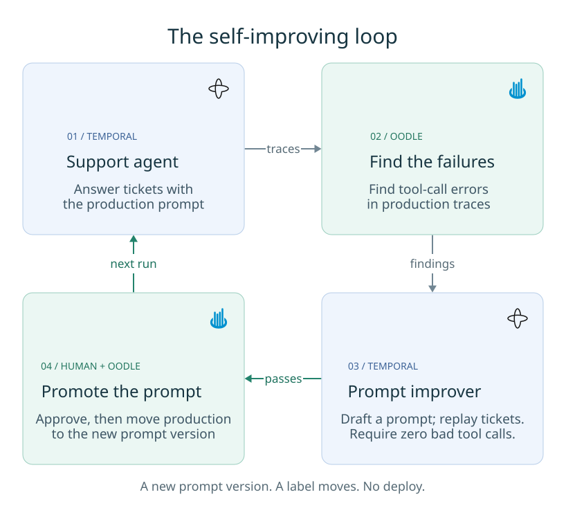
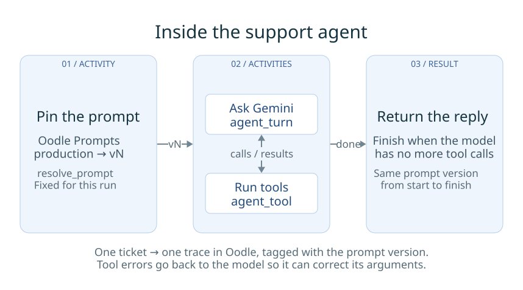
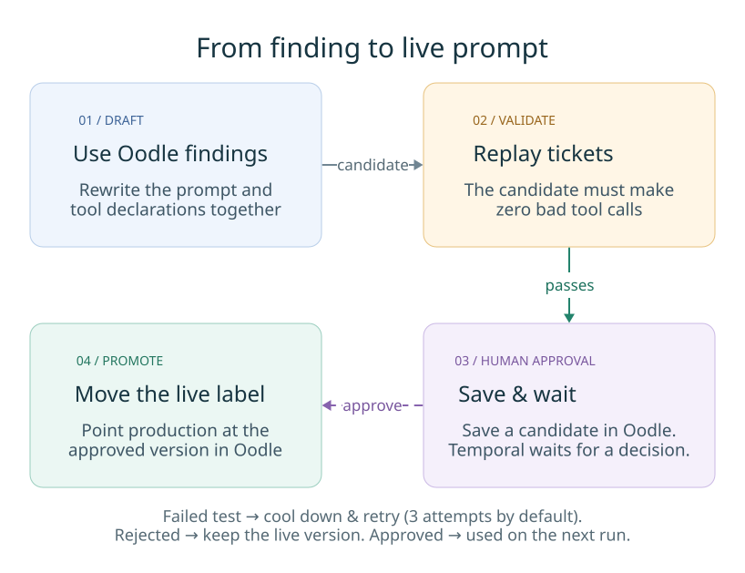

# Blog diagrams

Three compact figures, designed to remain readable in a blog column. Use the SVGs
in the post; they include their fonts and stay sharp at any size. The full
explanation lives in the [demo README](../README.md).

## 1. The feedback loop

Two Temporal workflows, Oodle's findings, and an approved prompt version reaching
the next agent run. Read clockwise from the top left.



[D2 source](01-overview.d2) · [SVG](01-overview.svg)

## 2. One agent run

Resolve the production prompt once, exchange model and tool calls, then return
the reply. All Activities belong to one trace with the same prompt version.



[D2 source](02-support-agent-workflow.d2) · [SVG](02-support-agent-workflow.svg)

## 3. The promotion path

Findings become a candidate, the candidate passes the tool-error gate, and a
person approves moving the production label. Failure outcomes sit below the flow
to keep the successful path easy to follow.



[D2 source](03-prompt-improver-workflow.d2) · [SVG](03-prompt-improver-workflow.svg)

## Rebuilding

```bash
brew install d2
cd diagrams
d2 fmt --check _style.d2 0*.d2
for f in 0*.d2; do d2 "$f" "${f%.d2}.svg" || exit; done
```

Verified with D2 0.7.1. [`_style.d2`](_style.d2) sets the ELK layout, shared colors,
type sizes, and spacing. Blue identifies workflow work, green identifies Oodle
and promotion, amber marks validation, and purple marks human approval. The
dashed purple arrow is the approval signal.

The figures use grids with connections only between adjacent cells. D2's free
layout engines draw straight connections inside grids, so keep distant service
dependencies in labels rather than adding arrows across intervening cells. See
the [D2 grid documentation](https://d2lang.com/tour/grid-diagrams/#connections-between-grid-cells).

Keep the SVGs generated from D2; edit the sources and rebuild rather than editing
SVG coordinates. Implementation details, additional signals, and failure branches
are intentionally left to the surrounding prose.
